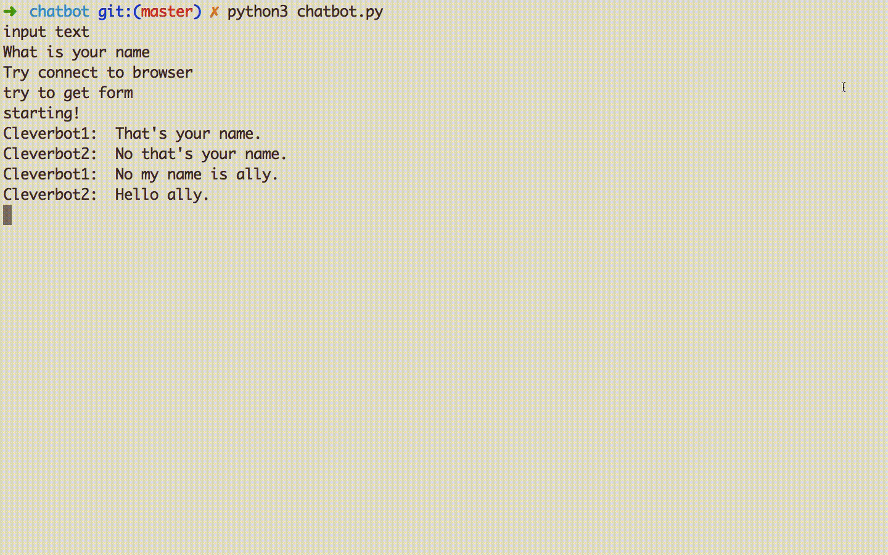

This is a command line interface of two talking chatbots. 
I used Cleverbot python wrapper and gTTS to create the project. 
Currently in beta testing and not working so well :)

To use try it, just run chatbot.py with python3.

